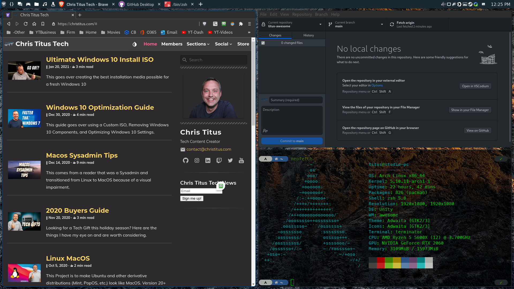

## Material and Mouse driven theme for [AwesomeWM](https://awesomewm.org/)

### Original design by PapyElGringo. Cloned from [ChrisTitusTech/titus-awesome](https://github.com/ChrisTitusTech/titus-awesome)

This repo is designed to be compatible with AwesomeWM latest (4.3) and the git HEAD.
I primarily use latest, so this may be undertested on HEAD.
If you notice any issues, please create an issue or PR!

An almost desktop environment made with [AwesomeWM](https://awesomewm.org/) following the [Material Design guidelines](https://material.io) with a performant opinionated mouse/keyboard workflow to increase daily productivity and comfort.

[](https://www.reddit.com/r/unixporn/comments/anp51q/awesome_material_awesome_workflow/)

## Installation

for convenience, a `setup.sh` script has been provided, simply clone the repository and run `./setup.sh` to auto install dependencies and setup submodules.
If using `setup.sh`, skip to 3) after successfully running it.

```shell
git clone 'https://github.com/aarondill/awesome' ~/.config/awesome
cd ~/.config/awesome/ && ./setup.sh
# run lxappearance to modify theme if so desired
```

NOTE: `setup.sh` calls `awesome --version` to make sure luaposix is compiled with the right version of lua. if your awesome or lua are not in the PATH, set $AWESOME or $LUA respectively to override the executable.
Note that $LUA's version _must_ match the version that will be used by awesome

```shell
awesome-client 'require("naughty").notify({text=_VERSION})' # awesome v4.3 or before
awesome-client 'require("naughty").notify({message=_VERSION})' # awesome v4.4 or later
```

Minimum required to run this configuration (not recommended):

```
git clone 'https://github.com/aarondill/awesome' ~/.config/awesome
cd ~/.config/awesome && git submodule update --init --recursive
```

### Program list (note: may be outdated. See `setup.sh` for full dependency list)

- [AwesomeWM](https://awesomewm.org/) as the window manager - universal package install: awesome
- [Roboto](https://fonts.google.com/specimen/Roboto) as the **font** - Debian: fonts-roboto Arch: ttf-roboto
- [Rofi](https://github.com/DaveDavenport/rofi) for the app launcher - universal install: rofi
- [picom](https://github.com/yshui/picom) for the compositor (blur and animations) Universasal install: picom
- [i3lock](https://github.com/meskarune/i3lock-fancy) the lockscreen application universal install: i3lock-fancy
- [xclip](https://github.com/astrand/xclip) for copying screenshots to clipboard package: xclip
- [gnome-polkit] recommend using the gnome-polkit as it integrates nicely for elevating programs that need root access
- [lxappearance](https://sourceforge.net/projects/lxde/files/LXAppearance/) to set up the gtk and icon theme
- [flameshot](https://flameshot.org/) screenshot utility of choice, can be replaced by whichever you want, just remember to edit the `configuration/apps/default.lua` file
- [pasystray](https://github.com/christophgysin/pasystray) Audio Tray icon for PulseAudio. Replace with another if not running PulseAudio.
- [network-manager-applet](https://gitlab.gnome.org/GNOME/network-manager-applet) nm-applet is a Network Manager Tray display from GNOME.
- [xcape](https://github.com/alols/xcape) xcape makes single taps of ctrl (or caps lock) emit an ESC code
- [blueman](https://github.com/blueman-project/blueman/) blueman is a simple bluetooth manager that doesn't depend on any specific DE.
- [diodon](https://github.com/diodon-dev/diodon) is a clipboard manager to keep clipboard after closing a window
- [udiskie](https://github.com/coldfix/udiskie) handles USB drives and auto-mount

## Set the themes

Start `lxappearance` to activate the **icon** theme and **GTK** theme
Note: for cursor theme, edit `~/.icons/default/index.theme` and `~/.config/gtk3-0/settings.ini`, for the change to also show up in applications run as root, copy the 2 files over to their respective place in `/root`.

Recommended Cursors - <https://github.com/keeferrourke/capitaine-cursors>

### Same theme for Qt/KDE applications and GTK applications

install `qt5-style-plugins` (debian) | `qt5-styleplugins` (arch)

## Configuration:

All configuration should be possible through the `/configuration` directory.
Note that some of this has become complicated, so please report an issue if any arise.

## Running:

Start awesome you might start any other X window manager.

If you don't know how to do this, I suggest you research the topic.
Use one of the following commands, depending on your installed packages:

```
startx "$(which awesome)"
xinit "$(which awesome)"
```

If you cloned the repository to an unusual location, you can use awesome's `-c` option to start it
The configuration should handle this without issue.

```
startx "$(which awesome)" -c "<PATH TO THE REPO>/rc.lua"
```
