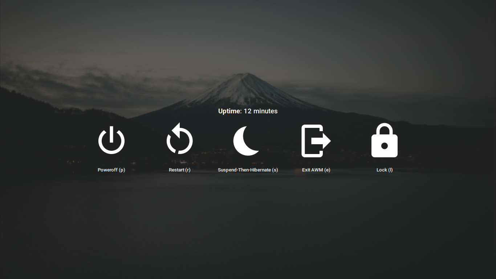

<!--- This is a generated file. Do not edit it directly. Edit the template instead. -->
## Theme for [AwesomeWM](https://awesomewm.org/)

### Original design by [PapyElGringo](https://github.com/PapyElGringo). Cloned from [ChrisTitusTech/titus-awesome](https://github.com/ChrisTitusTech/titus-awesome)

This repo is designed to be compatible with AwesomeWM latest (4.3) and the git HEAD.
I primarily use latest, so this may be undertested on HEAD.
If you notice any issues, please create an issue or PR!

An almost desktop environment made with [AwesomeWM](https://awesomewm.org/) with a performant opinionated keyboard workflow to increase daily productivity and comfort.


| Full Screen | Rofi Launcher | Exit Screen | Shortcut Menu |
| :---------: | :-----------: | :---------: | :-----------: |
|  |  |  |  |

## Installation

### `setup.lua`

For convenience, a `setup.lua` script has been provided, simply clone the repository and run `lua ./setup.lua` to auto install dependencies and setup submodules.
note: Gio is required. Installing `awesome` will install `gio` as a dependency.
note: LGI is required. This may need to be installed manually.

```shell
> git clone 'https://github.com/aarondill/awesome' ~/.config/awesome
> pacman -S awesome lua-lgi # REPLACE WITH YOUR PACKAGE MANAGER
> cd ~/.config/awesome/ && ./setup.lua
> # run lxappearance to modify theme if so desired
```

### Program List

<!-- This is generated via lua. Note: the full line must match `^%s*{{([%w_-]+)}}%s*$` -->

- Arch:
  - [awesome](https://awesomewm.org/): AwesomeWM
  - [blueman](https://github.com/blueman-project/blueman): Bluetooth - System Tray
  - [brightnessctl](https://github.com/Hummer12007/brightnessctl): adjusting screen brightness with keyboard shortcuts
  - [diodon](https://github.com/diodon-dev/diodon): Persistent cliboard manager
  - [flameshot](https://flameshot.org): Screenshot tool
  - [i3lock](https://i3wm.org/i3lock/): Screen locker - `lock` script
  - [ibus](https://github.com/ibus/ibus): Changing input method - System Tray
  - [libinput](https://wayland.freedesktop.org/libinput/doc/latest/): Needed for libinput-gestures (touchpad gestures)
  - [libpulse](https://www.freedesktop.org/wiki/Software/PulseAudio/): Adjust volume with keyboard shortcuts
  - [network-manager-applet](https://apps.gnome.org): Network - System Tray
  - [numlockx](https://github.com/rg3/numlockx): Enable Numlock on startup
  - [pacutils](https://github.com/andrewgregory/pacutils): Get update count
  - [pasystray](https://github.com/christophgysin/pasystray): Audio system tray
  - [picom](https://github.com/yshui/picom): Compositor
  - [playerctl](https://github.com/altdesktop/playerctl): Control media players
  - [polkit-gnome](https://wiki.gnome.org/Projects/PolicyKit): Polkit
  - [qt5-styleplugins](https://github.com/qt/qtstyleplugins): Use GTK theme in Qt applications
  - [redshift](https://github.com/jonls/redshift): Automatically adjust screen temperature
  - [rofi-git](https://github.com/davatorium/rofi): Window switcher and application launcher - Git Version has some fixes
  - [ttf-roboto](https://fonts.google.com/specimen/Roboto): The primary font
  - [udiskie](https://github.com/coldfix/udiskie): Automatically mount removable media - System Tray
  - [xclip](https://github.com/astrand/xclip): Copy to clipboard
  - [xorg-xrandr](https://www.x.org/wiki/): xrandr - needed for autorandr, xset - disable DPMS
  - [xss-lock](https://bitbucket.org/raymonad/xss-lock/src/master/): Auto-lock on suspend/idle

- Debian / Ubuntu:
  - [awesome](https://awesomewm.org/): AwesomeWM
  - [blueman](https://github.com/blueman-project/blueman): Bluetooth - System Tray
  - [brightnessctl](https://github.com/Hummer12007/brightnessctl): adjusting screen brightness with keyboard shortcuts
  - [diodon](https://github.com/diodon-dev/diodon): Persistent cliboard manager
  - [flameshot](https://flameshot.org): Screenshot tool
  - [fonts-roboto](https://fonts.google.com/specimen/Roboto): The primary font
  - [i3lock](https://i3wm.org/i3lock/): Screen locker - `lock` script
  - [ibus](https://github.com/ibus/ibus): Changing input method - System Tray
  - [libinput-tools](https://wayland.freedesktop.org/libinput/doc/latest/): Needed for libinput-gestures (touchpad gestures)
  - [network-manager-gnome](https://apps.gnome.org): Network - System Tray
  - [numlockx](https://github.com/rg3/numlockx): Enable Numlock on startup
  - [pasystray](https://github.com/christophgysin/pasystray): Audio - System Tray
  - [picom](https://github.com/yshui/picom): Compositor
  - [playerctl](https://github.com/altdesktop/playerctl): Control media players
  - [policykit-1-gnome](https://wiki.gnome.org/Projects/PolicyKit): Polkit
  - [pulseaudio-utils](https://www.freedesktop.org/wiki/Software/PulseAudio/): Adjust volume with keyboard shortcuts
  - [qt5-style-plugins](https://github.com/qt/qtstyleplugins): Use GTK theme in Qt applications
  - [redshift](https://github.com/jonls/redshift): Automatically adjust screen temperature
  - [rofi](https://github.com/davatorium/rofi): Window switcher and application launcher
  - [udiskie](https://github.com/coldfix/udiskie): Automatically mount removable media - System Tray
  - [x11-xserver-utils](https://www.x.org/wiki/): xrandr - needed for autorandr, xset - disable DPMS
  - [xclip](https://github.com/astrand/xclip): Copy to clipboard
  - [xss-lock](https://bitbucket.org/raymonad/xss-lock/src/master/): Auto-lock on suspend/idle


## Set the theme (optional)

Install `lxappearance` to setup the _icon and GTK_ themes
Note: copy `~/.config/gtk3-0/settings.ini` to `~root/config/gtk3-0/settings.ini` to also show up in applications run as root

## Configuration:

All configuration should be possible through the `/configuration` directory.
Note that some of this has become complicated, so please report an issue if any arise.

## Running:

Start awesome you might start any other X window manager.

```shell
> startx "$(which awesome)"
```

If you cloned the repository to an unusual location, you can use awesome's `-c` option to start it
The configuration should handle this without issue.

```shell
startx "$(which awesome)" -c "<PATH TO THE REPO>/rc.lua"
```

### Lines of code

<!-- This is generated via github workflow -->cloc|github.com/AlDanial/cloc v 1.96  T=0.38 s (695.1 files/s, 30999.9 lines/s)
--- | ---

Language|files|blank|comment|code
:-------|-------:|-------:|-------:|-------:
Lua|169|869|2357|7629
SVG|84|8|23|474
Markdown|3|46|4|152
YAML|4|17|55|100
Bourne Again Shell|2|5|18|27
JSON|1|0|0|20
TOML|1|1|0|9
Text|1|0|0|4
--------|--------|--------|--------|--------
SUM:|265|946|2457|8415
