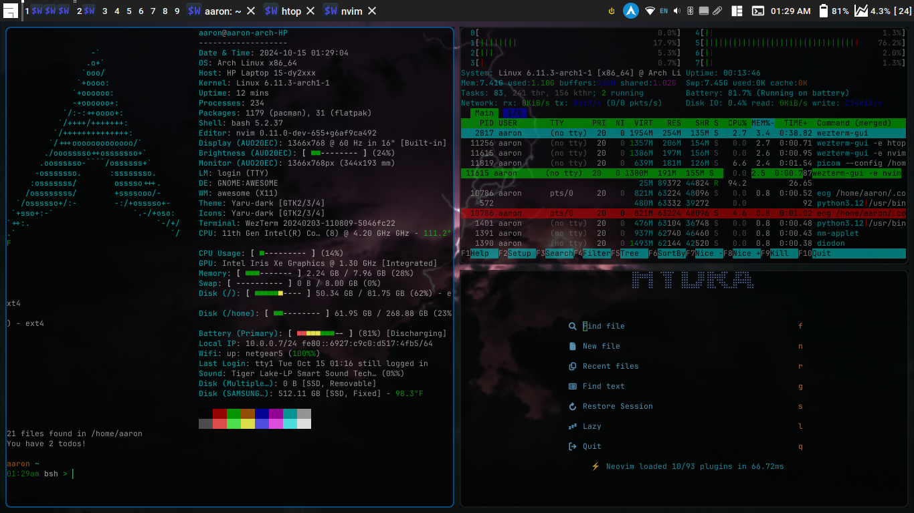

<!--- This is a generated file. Do not edit it directly. Edit the template instead. -->
## Theme for [AwesomeWM](https://awesomewm.org/)

### Original design by [PapyElGringo](https://github.com/PapyElGringo). Cloned from [ChrisTitusTech/titus-awesome](https://github.com/ChrisTitusTech/titus-awesome)

This repo is designed to be compatible with AwesomeWM latest (4.3) and the git HEAD.
I primarily use latest, so this may be undertested on HEAD.
If you notice any issues, please create an issue or PR!

An almost desktop environment made with [AwesomeWM](https://awesomewm.org/) with a performant opinionated keyboard workflow to increase daily productivity and comfort.



|             Fullscreen             |        Rofi Launcher         |             Exit Screen             |
| :--------------------------------: | :--------------------------: | :---------------------------------: |
|  |  |  |

## Installation

### `setup.lua`

For convenience, a `setup.lua` script has been provided, simply clone the repository and run `lua ./setup.lua` to auto install dependencies and setup submodules.

```shell
> git clone 'https://github.com/aarondill/awesome' ~/.config/awesome
> cd ~/.config/awesome/ && ./setup.lua
> # run lxappearance to modify theme if so desired
```

### Program List

<!-- This is generated via lua. Note: the full line must match `^%s*{{([%w_-]+)}}%s*$` -->

- Arch:
  - i3lock: Screen locker
  - numlockx: Enable Numlock on startup
  - libpulse: Adjust volume with keyboard shortcuts
  - xss-lock: Auto-lock on suspend/idle
  - ibus: Changing input method - System Tray
  - pacutils: Get update count
  - brightnessctl: adjusting screen brightness with keyboard shortcuts
  - awesome: AwesomeWM
  - pasystray: Audio system tray
  - picom: Compositor
  - libinput: Needed for libinput-gestures (touchpad gestures)
  - redshift: Automatically adjust screen temperatur
  - ttf-roboto: The primary font
  - blueman: Bluetooth - System Tray
  - qt5-styleplugins: Use GTK theme in Qt applications
  - polkit-gnome: Polkit
  - rofi-git: Window switcher and application launcher - Git Version has some fixes
  - diodon: Persistent cliboard manager
  - xclip: Copy to clipboard
  - playerctl: Control media players
  - udiskie: Automatically mount removable media - System Tray
  - network-manager-applet: Network - System Tray
  - flameshot: Screenshot tool
  - xorg-xrandr: xrandr - needed for autorandr, xset - disable DPMS

- Debian / Ubuntu:
  - i3lock: Screen locker
  - numlockx: Enable Numlock on startup
  - xss-lock: Auto-lock on suspend/idle
  - rofi: Window switcher and application launcher
  - brightnessctl: adjusting screen brightness with keyboard shortcuts
  - awesome: AwesomeWM
  - pasystray: Audio - System Tray
  - picom: Compositor
  - pulseaudio-utils: Adjust volume with keyboard shortcuts
  - redshift: Automatically adjust screen temperature
  - x11-xserver-utils: xrandr - needed for autorandr, xset - disable DPMS
  - libinput-tools: Needed for libinput-gestures (touchpad gestures)
  - blueman: Bluetooth - System Tray
  - fonts-roboto: The primary font
  - qt5-style-plugins: Use GTK theme in Qt applications
  - network-manager-gnome: Network - System Tray
  - udiskie: Automatically mount removable media - System Tray
  - ibus: Changing input method - System Tray
  - playerctl: Control media players
  - diodon: Persistent cliboard manager
  - policykit-1-gnome: Polkit
  - flameshot: Screenshot tool
  - xclip: Copy to clipboard


## Set the theme (optional)

Install `lxappearance` to setup the _icon and GTK_ themes
Note: copy `~/.config/gtk3-0/settings.ini` to `~root/config/gtk3-0/settings.ini` to also show up in applications run as root

## Configuration:

All configuration should be possible through the `/configuration` directory.
Note that some of this has become complicated, so please report an issue if any arise.

## Running:

Start awesome you might start any other X window manager.

```shell
> startx "$(which awesome)"
```

If you cloned the repository to an unusual location, you can use awesome's `-c` option to start it
The configuration should handle this without issue.

```shell
startx "$(which awesome)" -c "<PATH TO THE REPO>/rc.lua"
```